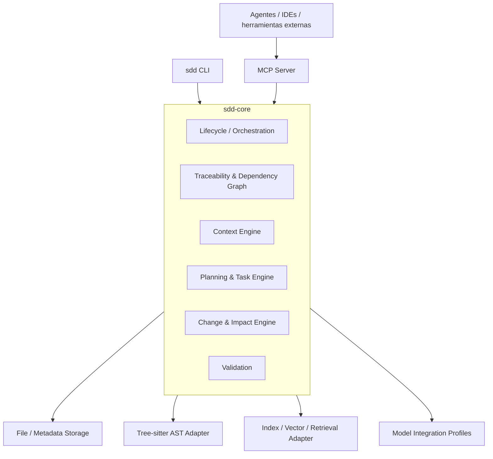
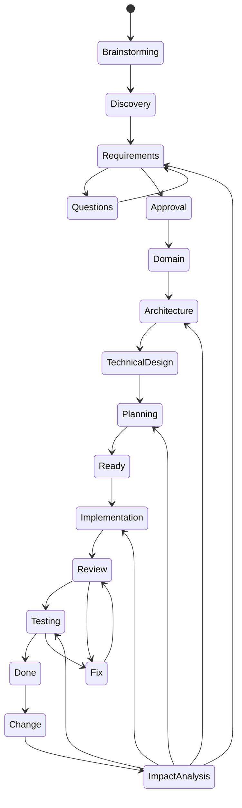
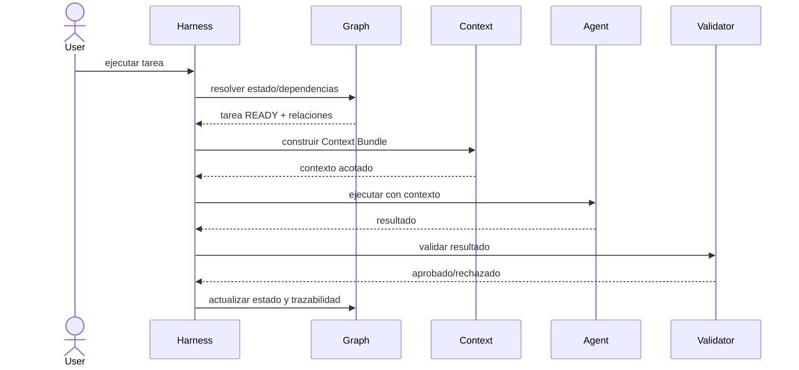
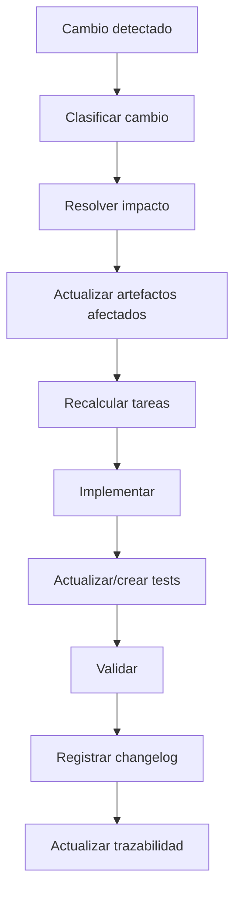

# Especificación Técnica — SDD AI Development Harness

## 1. Objetivo

Construir un framework local, instalable y versionable que funcione como harness de desarrollo basado en SDD. El core debe gestionar artefactos, relaciones, estados, contexto, validaciones y trazabilidad; la ejecución de agentes/LLMs debe ser desacoplada.

## 2. Arquitectura

Se utilizará Arquitectura Hexagonal (Ports & Adapters).



### 2.1. Regla arquitectónica

El core no debe depender directamente de:

- CLI;
- MCP;
- filesystem concreto;
- proveedor de LLM;
- base vectorial concreta;
- lenguaje de programación concreto.

Las dependencias deben expresarse mediante puertos.

## 3. Stack inicial

- Rust.
- Cargo workspace.
- Arquitectura hexagonal.
- `clap` para CLI.
- `serde` / `serde_json` para serialización.
- Tree-sitter para análisis AST multilenguaje.
- MCP mediante un adaptador compatible con la especificación vigente.
- Indexación y almacenamiento vectorial mediante un puerto abstracto.
- Git como mecanismo de versionado y fuente de reconstrucción.
- Markdown como formato principal de documentación humana.

La edición de Rust debe seguir una versión estable soportada por el proyecto; no debe etiquetarse una edición como "LTS".

El proyecto debe definir explícitamente MSRV, plataformas soportadas y estrategia de distribución del binario.

## 4. Estructura inicial del workspace

```text
sdd-framework/
├── Cargo.toml
├── crates/
│   ├── sdd-cli/
│   ├── sdd-core/
│   ├── sdd-storage/
│   ├── sdd-parser/
│   ├── sdd-mcp/
│   ├── sdd-index/
│   └── sdd-integrations/
├── tests/
├── docs/
└── .github/
```

La descomposición final de crates puede cambiar durante el diseño técnico si una decisión arquitectónica posterior lo justifica.

## 5. Modelo de artefactos

Los artefactos persistentes deben incluir como mínimo:

### Business

- brief;
- objetivos;
- alcance;
- restricciones;
- stakeholders, cuando corresponda.

### Discovery

- preguntas;
- respuestas;
- supuestos;
- riesgos;
- decisiones.

### Requirements

- requisitos funcionales;
- requisitos no funcionales;
- criterios de aceptación.

### Domain

- entidades;
- reglas;
- invariantes;
- relaciones.

### Architecture

- arquitectura;
- componentes;
- interfaces;
- decisiones;
- ADRs.

### Planning

- épicas/features;
- tareas;
- dependencias;
- asignación de agente;
- skills;
- Definition of Ready/Done.

### Verification

- estrategia de testing;
- tests;
- QA;
- reviews;
- resultados;
- evidencias.

### Change

- changelog;
- impacto;
- artefactos modificados;
- relación con commits/tareas.

## 6. Estructura `.sdd/`

La estructura debe evolucionar desde la propuesta original y quedar formalizada mediante el diseño del modelo de datos. Una estructura objetivo es:

```text
.sdd/
├── manifest.json
├── config/
│   ├── project.md
│   └── integrations/
├── brief/
│   └── brief.md
├── discovery/
│   ├── questions.md
│   ├── assumptions.md
│   └── risks.md
├── requirements/
├── domain/
├── architecture/
│   ├── architecture.md
│   └── adr/
├── design/
├── tasks/
├── agents/
├── skills/
├── tests/
├── changes/
│   └── CHANGELOG.md
├── context/
└── index/
```

Los archivos derivados, caches e índices deben identificarse claramente como derivados y poder reconstruirse.

## 7. Fuente de verdad

`.sdd/` + Git constituyen la fuente de verdad persistente del estado del framework dentro del proyecto.

Los índices, embeddings, AST cacheados, conteos y context bundles son artefactos derivados.

Cada derivado debe poder invalidarse mediante hashes/versiones de sus entradas.

## 8. Ciclo de vida



No todos los cambios recorren todas las etapas: el motor de impacto determina cuáles son necesarias.

## 9. Estado de tareas

Estado mínimo:

```text
DRAFT
READY
IN_PROGRESS
BLOCKED
REVIEW
QA
DONE
FAILED
REJECTED
CANCELLED
```

Las transiciones válidas deben estar definidas formalmente. Una tarea no debe poder ejecutarse si no cumple Definition of Ready.

## 10. Definition of Ready

Una tarea está READY cuando:

- tiene objetivo;
- tiene alcance;
- tiene criterios de aceptación;
- sus dependencias están resueltas;
- conoce las interfaces relevantes;
- tiene estrategia de testing;
- tiene agente/rol;
- tiene skills requeridos;
- no posee preguntas bloqueantes;
- puede construir un Context Bundle reproducible.

## 11. Context Bundle

El Context Engine debe construir un bundle específico para una tarea.

Contenido posible, priorizado:

```text
P0:
- tarea
- objetivo
- criterios de aceptación
- restricciones
- contratos/interfaces imprescindibles

P1:
- requisitos relacionados
- decisiones/ADRs
- dependencias
- dominio
- código directamente afectado
- tests relevantes

P2:
- documentación relacionada
- resultados previos
- contexto recuperado semánticamente

P3:
- información adicional solicitada explícitamente
```

El bundle debe registrar:

- origen de cada fragmento;
- motivo de inclusión;
- prioridad;
- hash;
- tokens estimados;
- presupuesto;
- elementos descartados por presupuesto.

## 12. Retrieval / RAG

La recuperación debe seguir una estrategia jerárquica:

1. relaciones explícitas del grafo;
2. dependencias;
3. scope;
4. AST;
5. búsqueda lexical;
6. búsqueda semántica/vectorial;
7. ranking final;
8. truncamiento según presupuesto.

RAG no debe utilizarse para descubrir relaciones que ya están declaradas explícitamente.

El índice vectorial debe ser un adaptador reemplazable.

## 13. AST

Tree-sitter debe utilizarse para obtener información estructural del código:

- módulos;
- clases;
- structs;
- interfaces;
- traits;
- funciones;
- métodos;
- imports;
- referencias relevantes.

La implementación debe ser extensible por lenguaje.

## 14. Skills

El framework debe incluir un catálogo de skills predefinidos.

Cada skill debe poder declarar:

- id;
- versión;
- descripción;
- aplicabilidad;
- entradas;
- instrucciones;
- restricciones;
- herramientas requeridas;
- outputs esperados;
- dependencias;
- ejemplos;
- compatibilidad.

Los proyectos pueden agregar skills propios.

Los skills deben poder ser seleccionados por tarea/agente y participar en el Context Bundle.

## 15. Agentes

El framework debe proporcionar roles/agentes predefinidos como mínimo:

- Planner;
- Implementer/Developer;
- Reviewer;
- QA.

También debe permitir agentes personalizados.

Cada agente debe declarar:

- capacidades;
- permisos;
- herramientas;
- tipos de tarea permitidos;
- skills compatibles;
- output contract;
- límites de contexto;
- acciones que requieren aprobación.

## 16. Integraciones con modelos

El core debe ser agnóstico al modelo.

Las integraciones específicas deben vivir fuera del dominio y describir cómo preparar el entorno para herramientas/modelos concretos.

Ejemplos de información de una integración:

- nombre;
- versión soportada;
- estructura de instrucciones;
- ubicación de archivos de contexto;
- mecanismo de invocación;
- capacidades MCP;
- limitaciones;
- formato esperado de contexto;
- estrategia de actualización.

El conocimiento de integración se versiona con Git dentro del framework.

## 17. Orquestación

El orquestador debe decidir:



El framework debe poder actuar como orquestador propio y también ser utilizado por agentes externos que consulten sus operaciones.

## 18. Cambios e impacto

Cualquier cambio significativo debe producir un registro de cambio.

Flujo:



Debe soportarse al menos:

- cambio de requisito;
- cambio de arquitectura;
- cambio de diseño;
- cambio de tarea;
- bug/fix;
- cambio de test;
- refactoring;
- cambio de integración.

## 19. Trazabilidad

El modelo debe representar relaciones entre:

```text
Brief
  ↓
Requirement
  ↓
Decision / ADR
  ↓
Architecture / Design
  ↓
Task
  ↓
Code Artifact
  ↓
Test
  ↓
Verification Result
```

Debe poder realizarse navegación en ambos sentidos.

## 20. Changelog

Cada cambio relevante debe registrar:

- identificador;
- fecha;
- motivo;
- origen;
- artefactos afectados;
- impacto;
- tareas afectadas;
- tests afectados;
- commits relacionados;
- agente/actor;
- aprobación cuando corresponda.

## 21. Human approval gates

Debe existir aprobación obligatoria, configurable en detalle, como mínimo antes de:

- cerrar requisitos;
- aprobar arquitectura;
- aprobar plan de implementación;
- integrar cambios que alteren contratos críticos.

El framework debe registrar quién/qué aprobó, cuándo y sobre qué versión.

## 22. Persistencia y concurrencia

Las escrituras de estado deben ser atómicas.

El framework debe evitar corrupción de `.sdd/` ante:

- procesos simultáneos;
- interrupciones;
- fallos de ejecución;
- recuperación.

## 23. Observabilidad

Cada ejecución debe registrar:

- task id;
- agent;
- skill;
- modelo si se conoce;
- contexto incluido;
- contexto descartado;
- tokens estimados/observados;
- duración;
- resultado;
- retries;
- validaciones;
- errores.

Esto permitirá medir el rendimiento real del harness.

## 24. CLI

La CLI debe evolucionar desde el borrador original y cubrir todo el lifecycle.

Comandos conceptuales:

```text
sdd init
sdd status
sdd plan
sdd brainstorm
sdd requirements
sdd questions
sdd architecture
sdd design
sdd tasks
sdd task <id>
sdd context <id>
sdd implement <id>
sdd test <id>
sdd review <id>
sdd change <id>
sdd impact <id>
sdd validate
sdd changelog
sdd hooks
```

Los comandos exactos, argumentos y contratos de salida deberán especificarse como parte del desarrollo.

## 25. MCP

MCP es un adaptador, no el núcleo.

Debe exponer operaciones equivalentes a las capacidades del core, incluyendo como mínimo:

- obtener estado;
- consultar tarea;
- obtener contexto;
- consultar relaciones;
- registrar resultado;
- registrar validación;
- registrar cambio;
- solicitar impacto.

Las operaciones deben tener contratos versionados.

## 26. Git

Las tareas deben poder asociarse con ramas y commits.

Convención propuesta:

```text
<tipo>/<TASK-ID>_<EXT-REF>-<descripcion>
```

Los commits utilizarán Conventional Commits y referencia de tarea cuando corresponda.

Ejemplo:

```text
feat(context): [TASK-FW-01] implement context bundle resolver
fix(parser): [TASK-FW-05] correct trait signature extraction
```

La integración con Jira/Linear/GitHub Issues/Azure DevOps debe ser opcional mediante adaptadores.

## 27. Seguridad y permisos

Los agentes deben operar con permisos mínimos.

Debe poder definirse:

- paths de lectura;
- paths de escritura;
- herramientas disponibles;
- operaciones prohibidas;
- operaciones que requieren aprobación.

## 28. Calidad

El framework debe tener:

- unit tests;
- integration tests;
- contract tests;
- CLI tests;
- MCP tests;
- e2e tests;
- fixtures reproducibles.

Para el código Rust se establece inicialmente:

```text
cargo fmt --check
cargo clippy -- -D warnings
cargo test
```

La cobertura objetivo debe medirse y configurarse; no debe convertirse en un número rígido si no existe una justificación por módulo.

## 29. Documentación

La documentación del framework debe incluir:

- arquitectura;
- modelo de datos;
- lifecycle;
- CLI;
- MCP;
- agentes;
- skills;
- integraciones;
- context engine;
- troubleshooting;
- desarrollo;
- testing.

Los diagramas arquitectónicos deben utilizar Mermaid. Cuando aporte valor, puede existir además una representación Lanshu.

## 30. Versionado

El framework debe versionarse con Git y aplicar una estrategia de releases compatible con Semantic Versioning.

Los cambios en formatos persistentes deben tener estrategia explícita de migración/compatibilidad.

## 31. Restricción fundamental

Ningún componente específico de un proveedor de LLM debe contaminar el dominio central.

El framework debe poder seguir gestionando el proyecto, sus especificaciones, tareas, relaciones y validaciones incluso si no existe una integración directa con un LLM.
