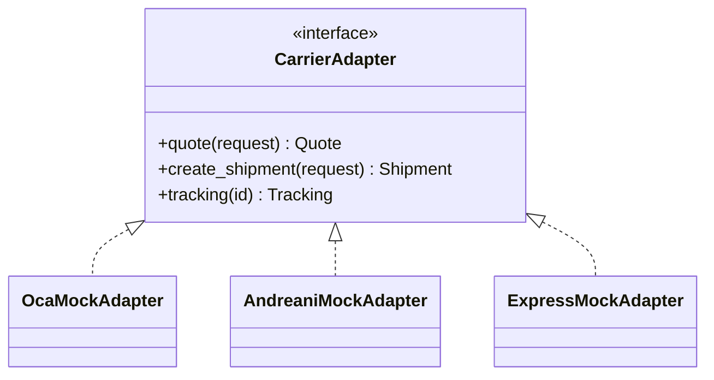
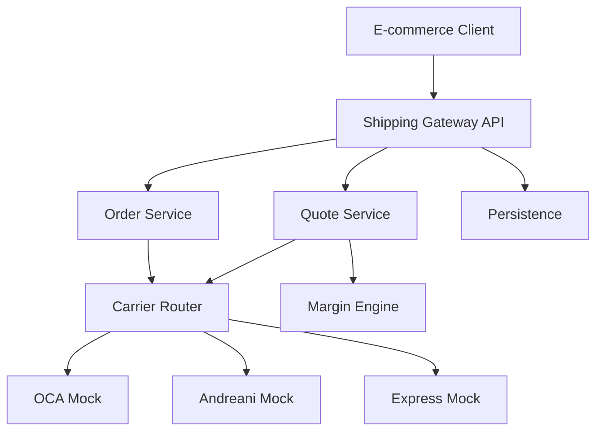

# PoC — Shipping Logistics Gateway

## 1. Objetivo

Validar el framework SDD completo sobre un proyecto suficientemente realista para ejercitar:

- brainstorming;
- discovery;
- requisitos;
- arquitectura;
- diseño;
- planificación;
- tareas;
- agentes;
- skills;
- context slicing;
- AST;
- persistencia;
- APIs;
- integraciones externas simuladas;
- testing;
- QA;
- fixes;
- cambios de requisitos;
- sincronización documental;
- changelog;
- trazabilidad.

Los carriers serán mockeados. La PoC no debe depender de APIs reales de OCA, Andreani u otros proveedores.

## 2. Producto

Construir un microservicio que permita a un cliente e-commerce:

1. solicitar cotizaciones de envío;
2. consultar transportistas disponibles;
3. aplicar reglas de margen;
4. crear una orden de envío;
5. obtener información de seguimiento/etiqueta simulada.

## 3. Alcance funcional

### 3.1. Cotización

El cliente proporciona origen, destino, peso y dimensiones.

El sistema consulta los carriers configurados y devuelve tarifas normalizadas.

### 3.2. Carrier abstraction

Todos los transportistas deben implementar un contrato común.



### 3.3. Margen

Las tarifas base pueden recibir reglas configurables de recargo/margen.

### 3.4. Órdenes

Una cotización seleccionada puede convertirse en una orden de envío.

### 3.5. Tracking

El sistema debe poder consultar un estado normalizado de seguimiento.

## 4. Arquitectura esperada



La arquitectura final debe ser producida y validada por el framework durante la PoC, no simplemente copiada desde este documento.

## 5. Requisitos de calidad

La PoC debe incluir:

- unit tests;
- integration tests;
- API tests;
- contract tests para carriers;
- error handling;
- observability mínima;
- validación de inputs;
- persistencia;
- documentación generada/mantenida por SDD.

## 6. Ejercicios obligatorios del framework

### Ejercicio A — Desarrollo inicial

Ejecutar:

```text
init
brainstorm
requirements
architecture
design
tasks
implement
test
review
```

### Ejercicio B — Cambio de requisito

Cambiar una regla de negocio de margen.

El framework debe:

1. detectar el cambio;
2. encontrar arquitectura/diseño/tareas afectados;
3. actualizar documentación;
4. actualizar tareas;
5. identificar tests afectados;
6. ejecutar/recomendar revalidación;
7. registrar changelog.

### Ejercicio C — Fix desde testing

Introducir un fallo en un carrier mock.

El flujo debe ser:

```text
test failure
→ issue/fix task
→ context slicing
→ implementation
→ test
→ review
→ documentation if affected
→ changelog
```

### Ejercicio D — Context slicing

Una tarea de implementación de un adapter debe recibir solamente el contexto relevante:

- tarea;
- requisito;
- contrato `CarrierAdapter`;
- interfaces necesarias;
- skill del adapter;
- tests relevantes.

No debe recibir innecesariamente las especificaciones completas de otros carriers o del motor de margen.

## 7. Métricas

La PoC debe registrar:

- tokens del contexto completo hipotético;
- tokens del Context Bundle;
- ratio de reducción;
- cantidad de artefactos recuperados;
- cantidad de artefactos descartados;
- iteraciones del agente;
- duración;
- tests ejecutados;
- fallos;
- cambios propagados correctamente.

No se establece un porcentaje de reducción como requisito previo; el objetivo es medirlo.

## 8. Criterio de éxito

La PoC se considera exitosa cuando el framework demuestra que puede llevar el proyecto desde una definición inicial hasta software probado y documentado, y posteriormente procesar un cambio o fix manteniendo coherentes:

```text
requirements
architecture
design
tasks
code
tests
traceability
changelog
```

## 9. Entorno

La primera validación práctica del harness se realizará, si es viable, mediante Warp + OpenCode. Esto no convierte a OpenCode ni a Warp en dependencias arquitectónicas del framework.
