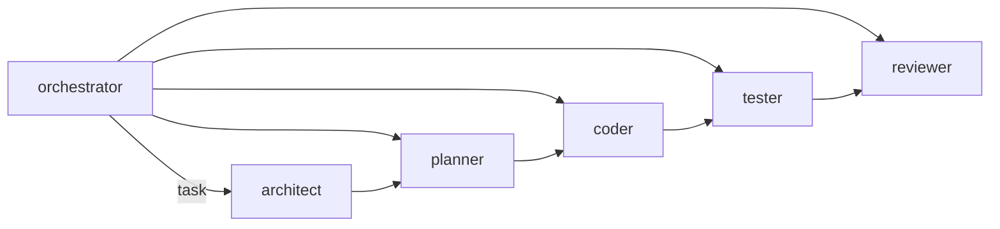

# Guía de Authoring de Agentes

Cómo crear agentes para el harness SDD (runtime OpenCode).

## 1. Ubicación y registro

```text
.opencode/agents/
├── orchestrator.md    # agente primario (punto de entrada)
├── architect.md
├── planner.md
├── coder.md
├── tester.md
└── reviewer.md
```

- Un archivo por agente; se cargan automáticamente desde `.opencode/agents/`.
- `opencode.json` fija `default_agent: "orchestrator"`.
- Registrar el agente en la tabla **Matriz de Agentes** de
  [`AGENTS.md`](../AGENTS.md) (sub-comando, modelo, mode, rol).
- Si el agente participa de un workflow, crear un slash command en
  `.opencode/commands/` (`description` en frontmatter + instrucciones).

## 2. Frontmatter

```yaml
---
name: reviewer
description: Auditoría de seguridad, calidad de código y adherencia a la especificación.
model: opencode-go/glm-5.3-flash
temperature: 0.1
mode: subagent
permission:
  read:
    src/*: allow
    tests/*: allow
  edit: deny
  bash:
    cargo fmt --check: allow
    cargo clippy *: allow
    "*": deny
  task: deny
---
```

| Campo | Regla |
|-------|-------|
| `name` | identificador corto (`snake_case`); coincide con el `@nombre` |
| `description` | una frase de rol; guía al orquestador en el enrutado |
| `model` | proveedor/modelo asignado (ver §4) |
| `temperature` | baja (0.0–0.2) para tareas deterministas; `tester` = `0.0` |
| `mode` | `primary` (agente de entrada) o `subagent` (invocado vía `task`) |
| `permission` | mapa de permisos por herramienta — **principio de mínimo privilegio** |

### Permisos

- `read` / `glob` / `grep`: rutas con `allow` explícito.
- `edit`: `deny` para agentes que no escriben (orchestrator, reviewer).
- `bash`: lista explícita de comandos con wildcard; terminar con
  `"*": deny`. Ej.: reviewer solo `cargo fmt/clippy/test` y `git
  status/diff/log` de solo lectura.
- `task`: `deny` salvo el orquestador (único que invoca subagentes).

## 3. Cuerpo del agente

Estructura canónica (ver `.opencode/agents/reviewer.md`):

1. **Role** — quién es y qué hace.
2. **Input** — artefactos de entrada con rutas exactas.
3. **Responsabilidades** — lista numerada.
4. **Checklist** — casillas verificables agrupadas por categoría.
5. **Quality Gates** — comandos exactos a ejecutar.
6. **Output** — forma del resultado.
7. **Output Contract** — contrato JSON estricto del dictamen/entregable.

Reglas:

- todo camino de archivo es concreto (`.docs/02-…`, `.sdd/tasks/`);
- los gates son los del workspace: `cargo fmt --all -- --check`,
  `cargo clippy --workspace --all-targets -- -D warnings`,
  `cargo test --workspace`;
- el output contract impide respuestas ambiguas entre agentes.

## 4. Asignación de modelos (matriz actual)

| Agente | Sub-comando | Modelo | Mode |
|--------|-------------|--------|------|
| orchestrator | `/orchestrate` | `qwen3.7-plus` | primary |
| architect | `/plan` | `kimi-k3` | subagent |
| planner | `/tasks` | `qwen3.7-plus` | subagent |
| coder | `/implement` | `kimi-k2.7-code` | subagent |
| tester | `/test` | `deepseek-v4.1-flash` | subagent |
| reviewer | `/review` | `glm-5.3-flash` | subagent |

Criterio: planificación → modelos de razonamiento; implementación → modelo
de código; verificación → modelos rápidos baratos; review → modelo de
auditoría con temperatura baja.

## 5. Flujo entre agentes



- Solo el `orchestrator` tiene `task: allow` (invoca subagentes).
- El `coder` escribe; `orchestrator` y `reviewer` tienen `edit: deny`.
- Las skills cargadas por el agente (§6) refuerzan workflow y convenciones.

## 6. Skills vinculadas

| Agente | Skills habituales |
|--------|-------------------|
| todos | `sdd-task-workflow`, `branching-sdd` |
| coder | `cargo-workspace`, `conventional-commits`, `rust-quality` |
| tester / reviewer | `rust-quality`, `conventional-commits` |

Ver [guía de skills](skill-authoring.md).

## 7. Checklist de autoría

- [ ] frontmatter completo (`name`, `description`, `model`, `mode`, `permission`);
- [ ] mínimo privilegio: `edit: deny` si no escribe; bash con `"*": deny` final;
- [ ] input/output con rutas y contratos concretos;
- [ ] quality gates del workspace incluidos;
- [ ] matriculado en `AGENTS.md`;
- [ ] slash command asociado si tiene sub-comando;
- [ ] modelo asignado según la matriz y temperatura coherente con el rol.
