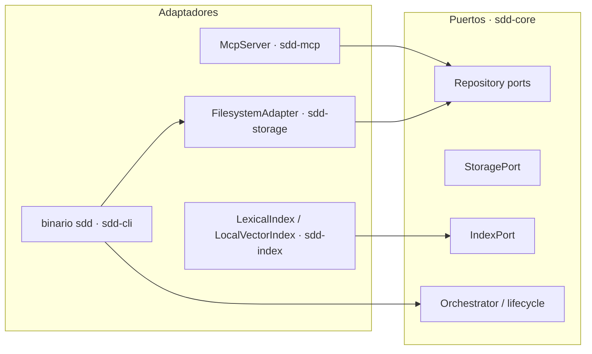
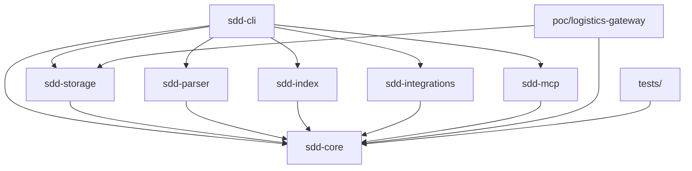
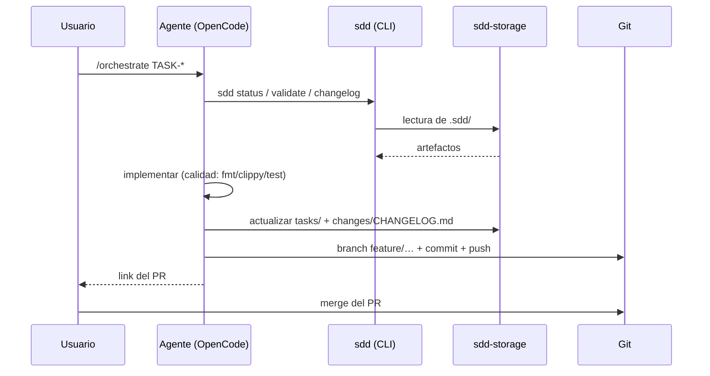

# Arquitectura — SDD AI Development Harness

Este documento resume la arquitectura del framework. Las decisiones
subyacentes están registradas en los [ADRs](adr/).

## 1. Estilo arquitectónico

**Hexagonal (Puertos y Adaptadores)** — ADR-001. El dominio define puertos
(traits); la infraestructura los implementa como adaptadores:

Consecuencias: el dominio (`sdd-core`) no realiza I/O ni depende de
adaptadores; cualquier adaptador es reemplazable y testeable en aislamiento.

## 2. Estructura del workspace

Cargo workspace multi-crate — ADR-002, MSRV 1.80 / edition 2021 — ADR-003.

| Capa | Crates | Responsabilidad |
|------|--------|-----------------|
| Dominio | `sdd-core` | Modelo, puertos, lifecycle, orquestación, trazabilidad, context, métricas (50 módulos, sin I/O) |
| Adaptadores | `sdd-storage`, `sdd-parser`, `sdd-index` | Persistencia `.sdd/`, parsing AST/markdown, retrieval |
| Integración | `sdd-integrations`, `sdd-mcp` | Contratos/perfiles de agente, servidor JSON-RPC |
| Presentación | `sdd-cli` | binario `sdd`, 17 subcomandos (clap) |
| Validación | `poc/logistics-gateway`, `tests/` | PoC end-to-end, suite de integración |

Regla de dependencias: solo `sdd-core` es base; ningún crate del dominio
depende de adaptadores; `sdd-cli` es la única pieza que los compone todos.

## 3. Persistencia: el directorio `.sdd/`

`sdd-storage` materializa el proyecto como estructura de archivos:

- `SddStructure`/`SddDirectoryLayout` — mapa canónico de directorios;
- `FilesystemAdapter` — escritura atómica (temp + rename), `initialize`
  idempotente, `load_manifest`/`save_manifest`;
- `Manifest` (`format_version`, `project_id`) con `CURRENT_FORMAT_VERSION = 1`
  y `MigrationManager` para evolucionar formatos;
- `changelog::parse_changelog` — parser puro del CHANGELOG (secciones `##`
  y anidadas `###`, campos `- **Key**: value`);
- `lock` — `FileLock`/`LockManager` para concurrencia;
- `default_templates()` — plantillas iniciales.

Git es el mecanismo de versionado: el directorio `.sdd/` se versiona
completo; `context/` e `index/` son derivados y reconstruibles.

## 4. Flujo de una iteración

La trazabilidad (requisito → tarea → commit → evidencia) se registra en
los artefactos `.sdd/` y se refuerza con convenciones de
branch/commit (`AGENTS.md`).

## 5. Dominio clave (`sdd-core`)

- **Lifecycle**: `lifecycle`, `lifecycle_engine`, `lifecycle_phases`,
  `approval_gates` — fases y puertas de aprobación.
- **Trazabilidad**: `traceability` (grafo de artefactos),
  `task_commit_mapping`, `branch_convention`, `commit_metadata`.
- **Context engineering**: `context_bundle*` (resolver, cache, priorizador,
  presupuesto de tokens `token_budget`), `retrieval_metrics`.
- **Cambios**: `change*`, `impact_analysis`, `change_propagation`.
- **Agentes**: `agent`, `agent_registry`, `skill`, `skill_registry`,
  `permission_engine`, `orchestrator`.
- **Verificación**: `verification`, `validation_metrics`, `output_contract`.

## 6. PoC como validación arquitectónica

`poc/logistics-gateway` ejercita la arquitectura en un dominio real
(Shipping Logistics Gateway): hexagonal propia, 3 transportistas mock,
motor de margen, repos en memoria, 21 tests y demo E2E — consumiendo
`sdd-storage` y `sdd-core`.

## 7. Gates de calidad

- `cargo fmt --all -- --check`
- `cargo clippy --workspace --all-targets -- -D warnings`
- `cargo test --workspace`

CI: `.github/workflows/ci.yml`.
