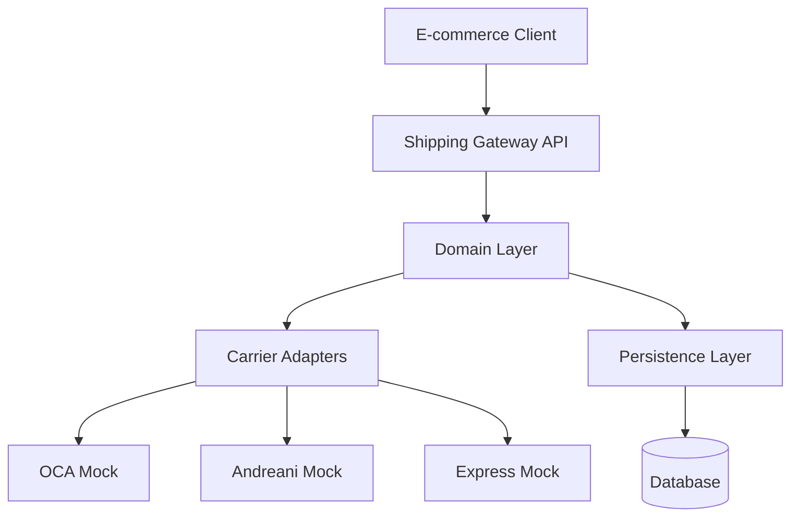
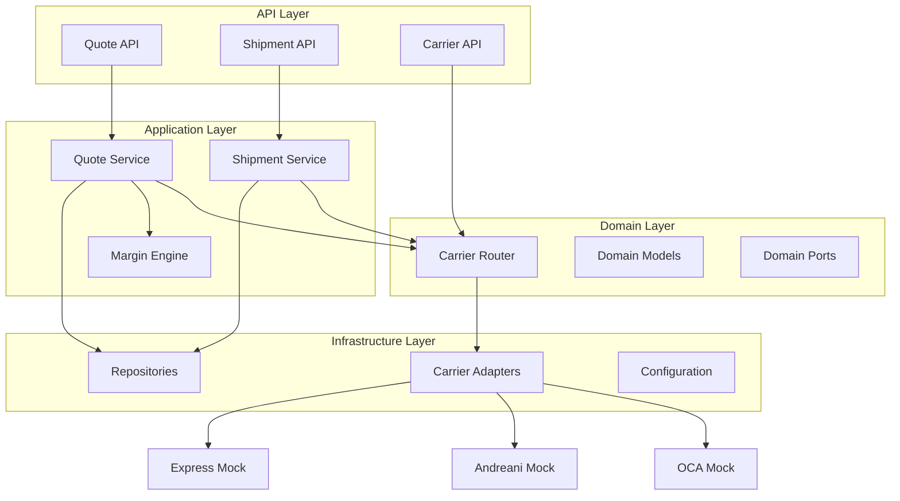
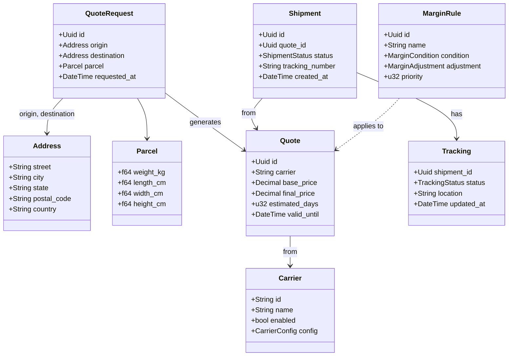
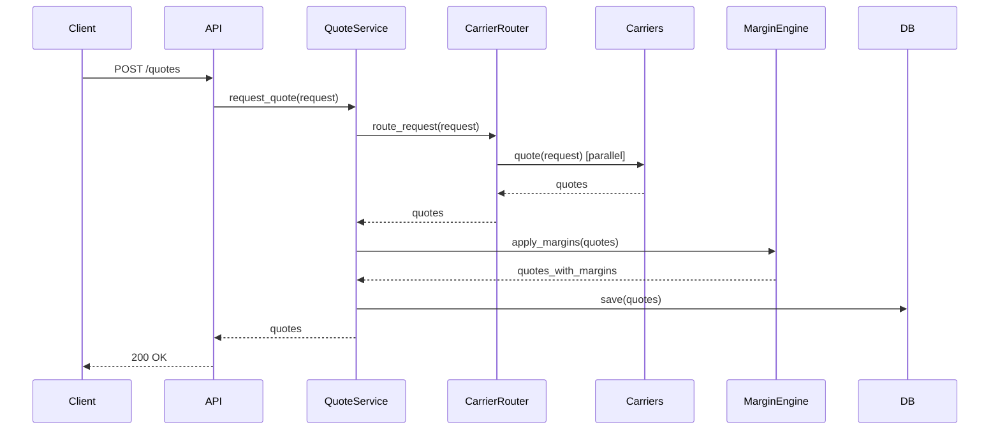
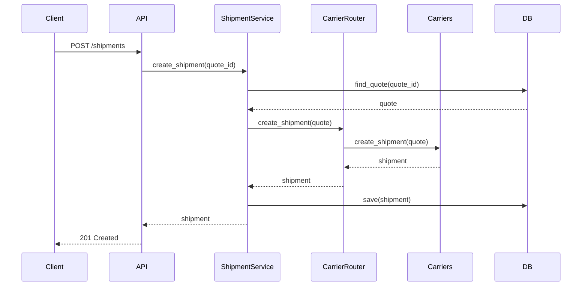
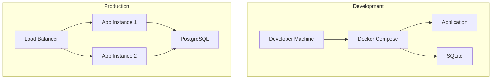

# Logistics Gateway — Architecture

## Architecture Style

**Hexagonal Architecture (Ports and Adapters)**

The system follows hexagonal architecture to separate domain logic from infrastructure concerns, enabling:
- Easy testing with mock adapters
- Flexible carrier integration
- Clear separation of concerns
- Independent evolution of domain and infrastructure

## System Context



## Component Architecture



## Domain Model



## Ports (Interfaces)

### Inbound Ports (Driving Side)

```rust
// Quote Service Port
trait QuoteService {
    async fn request_quote(request: QuoteRequest) -> Result<Vec<Quote>, QuoteError>;
    async fn get_quote(id: Uuid) -> Result<Quote, QuoteError>;
}

// Shipment Service Port
trait ShipmentService {
    async fn create_shipment(quote_id: Uuid) -> Result<Shipment, ShipmentError>;
    async fn get_shipment(id: Uuid) -> Result<Shipment, ShipmentError>;
    async fn get_tracking(shipment_id: Uuid) -> Result<Tracking, TrackingError>;
}
```

### Outbound Ports (Driven Side)

```rust
// Carrier Adapter Port
trait CarrierAdapter: Send + Sync {
    async fn quote(request: &QuoteRequest) -> Result<Quote, CarrierError>;
    async fn create_shipment(quote: &Quote) -> Result<Shipment, CarrierError>;
    async fn tracking(shipment_id: &str) -> Result<Tracking, CarrierError>;
}

// Repository Ports
trait QuoteRepository: Send + Sync {
    async fn save(quote: &Quote) -> Result<(), RepositoryError>;
    async fn find_by_id(id: Uuid) -> Result<Option<Quote>, RepositoryError>;
    async fn list() -> Result<Vec<Quote>, RepositoryError>;
}

trait ShipmentRepository: Send + Sync {
    async fn save(shipment: &Shipment) -> Result<(), RepositoryError>;
    async fn find_by_id(id: Uuid) -> Result<Option<Shipment>, RepositoryError>;
    async fn list() -> Result<Vec<Shipment>, RepositoryError>;
}

// Margin Policy Port
trait MarginPolicy: Send + Sync {
    fn apply(base_price: Decimal, context: &MarginContext) -> Decimal;
}
```

## Adapters

### Inbound Adapters

1. **REST API Adapter**
   - Implements HTTP endpoints
   - Converts HTTP requests to domain commands
   - Converts domain responses to HTTP responses
   - Handles HTTP-specific concerns (status codes, headers)

### Outbound Adapters

1. **OCA Mock Adapter**
   - Implements CarrierAdapter trait
   - Simulates OCA carrier behavior
   - Configurable scenarios (success, failure, timeout)

2. **Andreani Mock Adapter**
   - Implements CarrierAdapter trait
   - Simulates Andreani carrier behavior
   - Configurable scenarios

3. **Express Mock Adapter**
   - Implements CarrierAdapter trait
   - Simulates Express carrier behavior
   - Configurable scenarios

4. **Database Adapter**
   - Implements repository traits
   - Persists domain entities
   - Technology: SQLite (PoC) / PostgreSQL (Production)

5. **Configuration Adapter**
   - Loads configuration from files/environment
   - Provides configuration to domain services

## Data Flow

### Quote Request Flow



### Shipment Creation Flow



## Technology Decisions

### ADR-001: HTTP Framework
**Decision:** Axum  
**Rationale:** Modern, tokio-based, good ergonomics, active community  
**Consequences:** Requires async runtime, learning curve for team

### ADR-002: Persistence
**Decision:** SQLite for PoC, PostgreSQL for production  
**Rationale:** SQLite is simple and embedded, PostgreSQL is production-ready  
**Consequences:** Need migration strategy for production

### ADR-003: Serialization
**Decision:** Serde with JSON  
**Rationale:** Industry standard, excellent Rust support  
**Consequences:** JSON overhead acceptable for PoC

### ADR-004: Error Handling
**Decision:** Custom error types with thiserror  
**Rationale:** Type-safe errors, good integration with Rust ecosystem  
**Consequences:** More boilerplate, but better error handling

### ADR-005: Testing
**Decision:** cargo test with tokio::test for async  
**Rationale:** Built-in, integrates with CI/CD  
**Consequences:** Need to manage async test setup

## Deployment Architecture



## Security Considerations

1. **Input Validation:** All inputs validated at API boundary
2. **SQL Injection:** Parameterized queries only
3. **Rate Limiting:** Implement at API gateway level
4. **Logging:** No sensitive data in logs
5. **HTTPS:** Required for all API communication
6. **Authentication:** Future enhancement (not in PoC scope)

## Performance Considerations

1. **Async I/O:** All carrier calls are async
2. **Connection Pooling:** Database connection pool
3. **Caching:** Future enhancement for frequently accessed data
4. **Parallel Processing:** Quote requests to carriers in parallel
5. **Timeout Handling:** Configurable timeouts for carrier calls

## Scalability Considerations

1. **Horizontal Scaling:** Stateless application services
2. **Database Scaling:** Read replicas for PostgreSQL
3. **Carrier Scaling:** Add carriers without code changes
4. **Load Balancing:** Multiple app instances behind LB

## Monitoring and Observability

1. **Logging:** Structured logging with tracing
2. **Metrics:** Request latency, success rates, error rates
3. **Health Checks:** /health endpoint for liveness/readiness
4. **Distributed Tracing:** Request ID propagation
5. **Alerting:** Future enhancement

## Future Enhancements

1. **Authentication/Authorization:** API keys, OAuth2
2. **Caching:** Redis for quote caching
3. **Event Sourcing:** Event-driven architecture
4. **CQRS:** Separate read/write models
5. **International Shipping:** Multi-country support
6. **Real Carrier Integration:** Production carrier APIs
7. **Label Printing:** Integration with label services
8. **Webhooks:** Event notifications to clients
